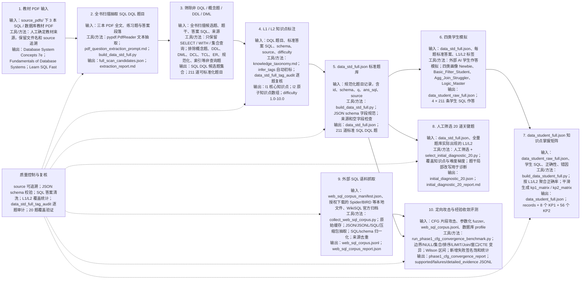

# 数据集构建流程图蓝图

本图用于说明 SQL DQL 数据集从教材 PDF 到标准题库、学生模拟作答、知识点掌握矩阵、20 题初始诊断集，以及面向 SQL 语义判等/归因系统的外部语料与对抗收敛证据构建链路。

已生成 SVG 图：

- `outputs/dataset_construction_flow_detailed.svg`

## 具体化流程图

## 节点展开

| 阶段 | 输入 | 工具/方法 | 输出 |
| --- | --- | --- | --- |
| 1. 教材 PDF 输入 | `source_pdfs/` 下三本教材 PDF | 人工确认教材来源；保留文件名和 source 字段用于追溯 | 三本权威教材输入源 |
| 2. 全书扫描抽取 | PDF 全文、练习题、答案段落 | `pypdf.PdfReader`；`pdf_question_extraction_prompt.md`；`build_data_std_full.py` | `full_scan_candidates.json`、`extraction_report.md` |
| 3. DQL 筛除 | 全书扫描候选题 | 保留 `SELECT` / `WITH` / 集合查询；排除概念题、DDL、DML、DCL、TCL、数据库设计题 | 211 道可标准化 SQL DQL 题 |
| 4. L1/L2 标注 | 题干、标准 SQL、schema、source | `knowledge_taxonomy.md`；`infer_tags` 初标；逐题标签审计 | `l1`、`l2`、`difficulty` |
| 5. 标准题库 | 规范化题目记录 | `build_data_std_full.py`；字段规范与空字段检查 | `data_std_full.json` |
| 6. 四类学生模拟 | `data_std_full.json` | 外部 AI 按四类学生画像生成 SQL 作答 | `data_student_raw_full.json` |
| 7. 掌握矩阵聚合 | 学生原始作答与正确性 | `build_data_student_full.py`；按 L1/L2 聚合正确率；平滑补全矩阵 | `data_student_full.json` |
| 8. 20 题诊断集 | `data_std_full.json` 与全量 L1/L2 覆盖情况 | 人工筛选；`select_initial_diagnostic_20.py`；覆盖和难度梯度校验 | `initial_diagnostic_20.json` |
| 9. 外部 SQL 语料抓取 | `web_sql_corpus_manifest.json`、在线归档、本地授权数据文件 | `collect_web_sql_corpus.py`；缓存原始下载；递归抽取 SQL；结构化 WikiSQL 转 SQL；schema 推断；来源去重 | `web_sql_corpus.jsonl`、`web_sql_corpus_report.json` |
| 10. 定向攻击与经验收敛评测 | CFG 片段攻击、参数化 fuzzer、外部 SQL 语料、数据库实例 profile | `run_phase1_cfg_convergence_benchmark.py`；默认 100k 参数化攻击 + 50k 外部语料派生样本；统计新增失败签名、Wilson 区间、来源分布 | `phase1_cfg_convergence_report.*`、`phase1_cfg_convergence_*.jsonl` |

## 产物关系

- `data_std_full.json` 是标准题库基准，后续学生模拟和 20 题诊断集都从它派生。
- `data_student_raw_full.json` 保存四类学生的原始 SQL 作答。
- `data_student_full.json` 在原始作答基础上生成 `records`、`kp1_matrix`、`kp2_matrix`。
- `initial_diagnostic_20.json` 从标准题库中人工筛选 20 道关键题，用于前端初始能力诊断。
- `web_sql_corpus.jsonl` 是外部 SQL 语料归一化结果，用于减少教材题库和手写攻击样本的分布偏见。
- `phase1_cfg_convergence_report.*` 是对当前 SQL 语义判等/归因流水线的经验收敛证据。它可以近似说明在给定语法片段、外部语料来源、数据库规模和攻击策略下未发现新增失败签名，但不能替代“任意 SQL 与任意数据库”的形式化语义完备证明。
