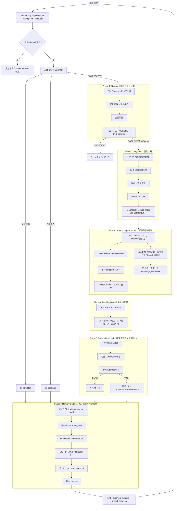

# SQL 智能教学系统—当前真实闭环控制流图

本文档对齐 Phase 1～6 的当前代码。初版中的“A* 错误排序”、“单一 lambda 同时控制支架和难度”、“BKT 后再做 0.6/0.4 平滑”以及“由 LLM 决定教学动作”均已移除。

## 一、完整流程

## 二、阶段间真实数据合同

| 边界 | 输入 | 输出 | 不可跨越的约束 |
|---|---|---|---|
| Phase 1 → 2 | 沙盒、AST、mutation 证据 | `DiagnosticPackage` | Phase 2 不能改写 Phase 1 verdict |
| Phase 2 → 3 | 版本化 rule/candidate 及正确判定 | trusted observations | `knowledge_points` 只显示，不直接写 BKT |
| Phase 3 → 4 | `selected_target` + support decision | `TeachingActionPlan` | 每轮最多聚焦一个原子错误 |
| Phase 4 → 5 | 已批准动作片段 | `StudentFeedbackArtifact` | 渲染器不决定 verdict/target/level |
| Phase 5 → 6 | 最终文本、摘要、实际等级 | 提交+审计+BKT+快照 | 四处实际等级必须一致 |

## 三、正误与降级分流

- `CORRECT`：可选根据权威 Q-matrix 产生正 BKT 观测；学生反馈是非自适应 L1 接受语。
- `WRONG + trusted target`：调度一个原子错误，实际交付 L1～L4；所有通过门控的观测分别更新 BKT。
- `WRONG + no trusted target`：不猜技能，交付通用 L1，`feedback_status=FALLBACK`。
- 语法错误/安全拦截：交付固定 L1，不产生 BKT 观测。
- Phase 4/5 失败：权威正误不变，降到答案无关的应急 L1；推荐保留作审计，但标记 `OVERRIDDEN`。
- `UNDECIDED`：不是学生错误，返回 422 并且不写入教学状态。

## 四、学生可见与服务端审计边界

学生可见：

- 权威正误、最终 `hint`；
- 不带技能身份的 `phase3_learning` 摘要；
- 只含推荐/实际等级和策略版本的 `teaching_support`；
- 幂等重放标记与教学反馈状态。

学生不可见：

- 完整 Phase 2 `diagnostic_package`；
- candidate/rule/skill/observation/Q-matrix 身份；
- reference SQL/AST、mutation SQL 或完整 witness world；
- `submission_teaching_audits.action_snapshot` 与因果 provenance。

## 五、对初版图的关键修正

1. `ConstrainedPriorityScheduler` 是分层稳定排序，不冒充 A* 搜索；`schedule_causal_priorities` 只是兼容入口名。
2. `support_need` 与 `challenge_readiness` 分开，`lambda_t` 仅保留兼容且始终为 `null`。
3. BKT 保存原始 posterior/next prior，不再二次 0.6/0.4 平滑。
4. Phase 4 真正使用 Phase 3 的单一 `selected_target`。
5. Phase 5 先生成确定性文本，可在持有用户行锁前调用受限 LLM 改写；最终泄漏闸门和确定性 L1 仍是硬兜底。
6. Phase 6 增加教学审计与响应快照，幂等重试不重跑昂贵阶段或重复写入教学状态。

细节分别见 Phase 1/2 冻结文档、《28-Phase3-v1-因果调度与原始BKT实现》和《29-Phase4-6-v1-教学支架反馈与事务闭环》。
