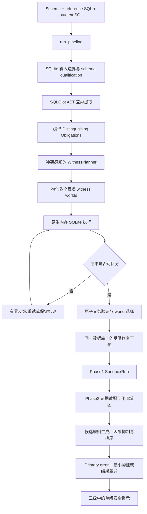

# SQL-Edu-Plus：SQLite Phase1 + Phase2 完整实现链路与技术栈

> 文档基于当前仓库代码整理，记录日期：2026-09-05。这里描述的是已经落地并通过回归测试的实现，不包含学生历史建模、多方言执行、Web 前端或尚未完成的实验设计。

## 1. 系统目标与当前边界

当前系统解决的问题是：

> 给定可信数据库模式、参考 SQL 和学生 SQL，自动构造紧凑、可执行的诊断性数据库实例，使两条查询的行为差异显现出来；再利用同一实例上的受限查询干预定位能够解释输出偏差的错误点，并把验证后的证据转换成不直接给出修复 SQL 的教学提示。

当前实现被严格收敛为：

- 单一 SQLite 解析与执行语义；
- Phase1：诊断性 witness 合成、执行比较、修复干预和有界结论；
- Phase2：证据分级、错误候选生成、查询作用域排序、主错误选择和安全提示；
- 无学生历史、知识状态或 BKT；
- 无 MySQL、PostgreSQL、Oracle、T-SQL 等执行器或方言路由；
- 默认完整链路不调用 LLM，不访问网络，不启动数据库容器。

系统不是通用 SQL 等价性证明器。没有发现反例时只返回 `NO_COUNTEREXAMPLE_FOUND`，不会声称两条 SQL 在所有数据库实例上全局等价。

## 2. 技术栈

| 层次 | 当前实现 | 用途 |
| --- | --- | --- |
| 运行时 | Python 3.11/3.12 | 编排、数据合成、证据处理和诊断规则 |
| SQL 解析与 AST | SQLGlot 29.0.1 | 以 `read="sqlite"` 解析查询、比较 AST、以 SQLite 方言确定性渲染 SQL |
| SQL 执行 | Python 标准库 `sqlite3` | 在独立的 `:memory:` 数据库中执行参考 SQL、学生 SQL 和修复变体 |
| 数据结构 | `dataclasses`、类型注解、`dict/list/tuple/set` | 表示 AST 差异、obligation、witness world、诊断候选和公开 DTO |
| 稳定证据标识 | `hashlib.sha256` + 规范化 JSON | 连接 AST diff、obligation、witness、mutation 和 Phase2 候选 |
| 无序结果比较 | `collections.Counter` | 按 bag/multiset 语义比较没有顶层 `ORDER BY` 的查询结果 |
| 正则执行保护 | `regex==2025.11.3` | 为 SQLite `REGEXP` 回调提供单次匹配超时和输入长度上限 |
| 测试 | pytest 9.0.2 | 单元测试、架构约束测试和 SQLite-only 回归测试 |
| 全链路评测 | 独立 Python 评测器 + JSON 数据集 | 从公开入口重放数据、审计提示、独立 SQLite 重放并检查确定性 |

当前研究核心没有 HTTP 框架、ORM、SQLAlchemy 或外部数据库驱动。`sqlite3` 是唯一执行后端。

## 3. 总体数据流



最短调用链是：

```text
core.pipeline.run_pipeline
  ├─ core.phase1_engine.generate_and_compare
  │    ├─ SQLite 输入检查和 schema qualification
  │    ├─ extract_ast_diffs
  │    ├─ compile_obligations
  │    ├─ WitnessPlanner.plan
  │    ├─ generate_test_database / generate_witness_suite
  │    ├─ _execute_sqlite
  │    ├─ obligation validation
  │    └─ mutation/repair verification
  └─ core.error_diagnosis.diagnose_record
       ├─ Phase1 evidence adaptation
       ├─ ScopedQueryGraph
       ├─ rule candidates and primary ranking
       ├─ bounded public witness
       └─ deterministic safe narrative
```

## 4. 公开入口与输入输出

公开编排入口位于 [`core/pipeline.py`](../sql-edu-backend/core/pipeline.py)：

```python
from core.pipeline import run_pipeline

result = run_pipeline(
    schema_text="students(id INTEGER PRIMARY KEY, score INTEGER)",
    reference_sql="SELECT id FROM students WHERE score >= 60",
    student_sql="SELECT id FROM students WHERE score > 60",
    question="找出所有及格学生",
    language="zh-CN",
    max_rows_per_table=8,
    schema_catalog=None,
)
```

输入字段：

| 字段 | 含义 |
| --- | --- |
| `schema_text` | 可重放的紧凑 schema；作为 Phase1 创建 SQLite 表的基础 |
| `reference_sql` | 教师提供的单条 SQLite 查询 |
| `student_sql` | 待诊断的单条 SQLite 查询 |
| `question` | 题意文本；只参与 Phase2 的 QSS 和提示语境，不参与 SQL 真值判定 |
| `language` | `zh-CN`、`zh-TW` 或 `en` 的确定性提示模板 |
| `max_rows_per_table` | 初始数据规模，默认 8；必要时可被 obligation 的最小行数要求提高 |
| `schema_catalog` | 可选结构化 schema，包含类型、主键、外键、唯一性与空值信息 |

返回 `PipelineResult`：

- `result.phase1`：服务器内部使用的 `SandboxRun`，包含完整 witness 和执行证据；
- `result.phase2`：服务器内部使用的 `DiagnosticPackage`；
- `result.learner_hint(level)`：唯一推荐给学生端序列化的接口。

## 5. 完整实现步骤

### 步骤 1：固定 SQLite 输入契约

入口函数 [`generate_and_compare`](../sql-edu-backend/core/phase1_engine.py) 首先执行以下检查：

1. 使用 `parse_schema_text` 和 `parse_schema_column_types` 解析紧凑 schema；
2. 对 schema 中以数字开头的合法标识符进行 schema-aware 引号修复；
3. 使用 `_detect_unsupported_features` 在执行前识别已知非 SQLite 构造；
4. 使用 `sqlglot.parse(..., read="sqlite", error_level=RAISE)` 严格解析两条 SQL；
5. 强制每侧恰好只有一条 `exp.Query`；
6. 拒绝 `main` 之外的 attached database namespace；
7. 不推断源方言，也不尝试跨方言转写。

非 SQLite 构造扫描会先屏蔽字符串、标识符和注释，避免把普通文本中的 `TOP`、`DATEADD` 等词误判为语法。已知的 `TOP`、`QUALIFY`、`LATERAL`、`DISTINCT ON`、`ILIKE`、`SIMILAR TO`、`TABLESAMPLE` 等构造会在执行前进入 `KNOWN_GAP/UNDECIDED`。

内部仍保留名为 `transpile_to_sqlite` 的兼容公开函数，但它只做经过验证的 SQLite → SQLite 规范化，不接收源方言参数。

### 步骤 2：建立可信 schema catalog 并校验查询作用域

[`witness_generation/schema_scope.py`](../sql-edu-backend/core/witness_generation/schema_scope.py) 将 schema 转换为 `SchemaCatalog`：

- `TableSchema`：表、列、主键、外键和唯一约束；
- `ColumnSchema`：列类型、nullable、generated 等属性；
- `QueryScope`：根查询、CTE、派生表和子查询作用域；
- `SchemaQualification`：物理表引用、缺失表、缺失列及可执行状态。

如果调用者提供结构化 `schema_catalog`，它是权威信息源；`schema_text` 只保留为可重放表示。否则系统从紧凑 schema 构造保守 catalog：未知 nullable 默认按可空处理，只有显式 `NOT NULL` 或主键才收紧约束。

参考 SQL 的 schema/解析错误被视为输入问题，不归责给学生。学生 SQL 引用不存在的表或列可以作为学生侧错误证据，但平台错误、执行超时和参考侧故障必须保守退出。

### 步骤 3：提取面向诊断的 AST 原子差异

[`extract_ast_diffs`](../sql-edu-backend/core/phase1_evidence.py) 使用 SQLGlot AST 比较参考查询和学生查询。输出是共享契约 [`ASTDiffNode`](../sql-edu-backend/core/ast_schema.py)，主要字段包括：

- `clause_category`：差异所在子句；
- `diff_type`：具体差异类型；
- `target_table` / `target_column`：可能的物理数据目标；
- `standard_node` / `student_node`：服务器内部 AST 片段；
- `knowledge_point_id`：教学知识点标签；
- `severity`：排序使用的有界严重度；
- `extra`：query scope、聚合、连接和相关子查询等上下文。

当前提取覆盖投影、谓词、比较边界、布尔结构、NULL、JOIN、GROUP BY、HAVING、聚合函数、DISTINCT、集合操作、窗口、ORDER BY、LIMIT/OFFSET、CASE、CTE、递归 CTE、普通与相关子查询等差异族。

提取器包含一组窄范围、可审计的等价改写规则，用来抑制明显的结构误报，例如已支持的 BETWEEN 展开或特定 JOIN 表达方式。它们不是通用等价性证明。

随后系统会：

- 去掉被原子差异完全覆盖的 summary diff；
- 避免同一嵌套差异被外层容器重复描述；
- 使用规范化内容的 SHA-256 生成 `diff_<16 hex>` 稳定 ID。

该 ID 不依赖差异在列表中的位置，因此在新增无关 summary diff 后，已有证据链不会整体漂移。

### 步骤 4：把差异编译为可区分义务

[`compile_obligations`](../sql-edu-backend/core/witness_generation/obligations.py) 把每个非冗余 AST diff 转换为 `DistinguishingObligation`。

一个 obligation 明确记录：

- 与其对应的 `diff_id`；
- 必须出现的表和列；
- 每个表的最小行数；
- hard/soft semantic constraints；
- 与其他义务的冲突关系；
- 预计构造成本；
- 成功条件，当前默认为参考结果与学生结果可区分。

约束模板不是自由文本，而是结构化 `ConstraintSpec`。典型语义包括：

- 边界值的 below/equal/above 三态；
- NULL 与非 NULL 路径；
- JOIN 匹配行和悬浮行；
- 聚合阈值所需的组大小；
- DISTINCT 所需的重复输出；
- 集合操作所需的重叠与非重叠分支；
- ORDER/LIMIT 所需的并列值和截断边界；
- 子查询 membership/correlation 路径；
- CASE 未覆盖分支和窗口分区/排序路径。

这里完成了论文表述中的“把候选语义差异编译为数据约束”。

### 步骤 5：规划相互隔离的 witness worlds

[`WitnessPlanner`](../sql-edu-backend/core/witness_generation/planner.py) 是确定性、带边界的冲突感知规划器，不是 SMT/SAT 或通用约束求解器。

当前策略是：

1. 按 `estimated_cost + obligation_id` 稳定排序；
2. 默认每个 obligation 单独进入一个 world，避免多个错误的数据约束互相覆盖；
3. 用 `ConstraintLedger` 管理每个语义单元格的唯一写入所有者；
4. 若两个策略要求同一单元格取不兼容值，则拒绝静默覆盖并拆分 world；
5. 当多个差异需要交互时，额外保留一个受限 composite world；
6. 总 world 数不超过 8。

`CellConstraint` 使用 `boundary_row`、`match_row`、`dangling_row` 等语义 row slot，而不是过早绑定物理下标。world 确定行数后才映射到具体单元格。

这种设计直接支持“多错误条件下不要一次混合归因”：每个差异先在独立数据库实例中接受原子验证，复合 world 只作为必要交互的后备证据。

### 步骤 6：物化紧凑诊断数据库

[`generate_test_database`](../sql-edu-backend/core/phase1_engine.py) 对每个 world 物化数据库：

1. 只保留参考 SQL 或学生 SQL 实际涉及的物理表；
2. 根据 schema 类型生成确定性的基础值；
3. 为可能的连接键建立共享值池，避免参考 JOIN 因随机错位而全部为空；
4. 根据 obligation 动态计算所需行数；
5. 激活当前 world 对应的定向探针；
6. 最后应用 planner 声明的 cell constraints；
7. 执行主键/唯一性、连接拓扑和数据类型稳定化；
8. 记录所有写入、覆盖和适配器冲突。

定向探针按差异族分布在以下模块中：

- [`phase1_constraints.py`](../sql-edu-backend/core/phase1_constraints.py)：边界、NULL、JOIN、GROUP/HAVING 等约束；
- [`phase1_query_paths.py`](../sql-edu-backend/core/phase1_query_paths.py)：子查询、相关路径、集合和跨表可达性；
- [`phase1_witness_strategies.py`](../sql-edu-backend/core/phase1_witness_strategies.py)：JOIN、NOT IN/NULL、表达式和 scope-aware 策略；
- [`phase1_witness_materialization.py`](../sql-edu-backend/core/phase1_witness_materialization.py)：最终 witness 稳定化；
- [`phase1_evidence.py`](../sql-edu-backend/core/phase1_evidence.py)：窗口、排序、集合分支、投影等物化及执行证据。

现有的大量确定性探针通过 `LegacyProbeAdapter` 纳入统一的 read/write set、write audit 和冲突拆分协议。这里的 “Legacy” 是 witness 探针兼容层，不是多方言执行遗留。

### 步骤 7：在原生 SQLite 上执行并比较行为

[`_execute_sqlite`](../sql-edu-backend/core/phase1_evidence.py) 对每次执行创建独立的 `sqlite3.connect(":memory:")`：

1. 只创建当前 witness 中需要的表；
2. 根据声明类型映射 SQLite affinity；
3. 使用参数化 `executemany` 插入数据；
4. 注册唯一的额外回调 `REGEXP(pattern, value)`；
5. 通过 SQLite progress handler 限制 VM 指令与墙钟时间；
6. 执行查询、归一化结果单元格并关闭连接。

结果比较遵循 SQLite 可观测语义：

- 参考查询的最外层存在 `ORDER BY` 时，按行序列精确比较；
- 没有最外层 `ORDER BY` 时，使用 `Counter` 按 bag/multiset 比较，保留重复行数量；
- 首先比较投影列数，再比较行值；
- 学生查询的普通执行错误可以形成行为冲突；
- 参考查询错误、平台错误或超时不会被包装成学生语义错误。

### 步骤 8：原子验证、有限反馈与 witness 选择

每个 world 最多尝试 8 次。一次执行后同时检查：

- `pair_distinguished`：完整参考 SQL 与学生 SQL 的结果是否不同；
- `obligation_distinguished`：这个 world 所属的原子差异是否真的被单独显现；
- `constraints_satisfied`：声明的语义约束是否实际物化；
- `causal_attribution_verified`：原子差异、语义 validator 和输出冲突是否形成闭环。

若义务未被显现，`apply_bounded_feedback` 只扩大该 obligation 指向的表、列和值域，不修改无关表。重试时行数逐步增加，但单表不会超过硬上限。

选择策略优先级为：

1. 能区分查询且通过原子义务验证的独立 world；
2. 对递归/集合差异有专门证据的 world；
3. 能区分查询的 composite world；
4. 如果没有反例，则选择首个可执行 world 形成保守结果。

最终选择、所有尝试、约束写入、validator 结果和未覆盖 obligation 都进入 Phase1 内部证据。

### 步骤 9：在同一 witness 上执行受限修复干预

找到可区分 world 后，系统才启用 mutation tests，避免在所有候选 world 上浪费执行预算。

修复干预的基本操作是：

- 将学生 AST 中一个候选节点替换为对应参考节点；
- 或替换一个受限子句；
- 必要时测试删除学生侧多余节点；
- 在完全相同的 witness 数据库上重新执行；
- 检查变体结果是否恢复为参考结果。

每条 mutation evidence 记录：

- 关联的 `diff_ids`；
- query scope 和 mutation scope；
- 是否存在 dependent changes；
- replacement 是否成功执行；
- replacement 后是否与参考输出一致；
- `fixed_by_replacement`；
- exact/approximate binding quality。

只有“精确绑定到一个 diff、没有额外依赖修改、替换成功执行且恢复结果”的干预，才可以在 Phase2 获得强 `REPAIR_VERIFIED` 证据。整段子句替换可以作为 bundle 证据，但不会自动证明其中每个差异都是独立根因。

修复 SQL、参考 AST 片段和 mutation SQL 始终是服务器内部证据，不进入学生提示。

### 步骤 10：生成有界 Phase1 结论

Phase1 输出对象是 [`SandboxRun`](../sql-edu-backend/core/phase1_foundation.py)，包括：

- 规范化后的两条 SQLite 查询；
- 参考/学生输出和列信息；
- 选中的 `test_database`；
- `ast_diffs`；
- `data_evidence`；
- `mutation_evidence`；
- `status`、`equivalence_conclusion` 和 `judge_status`。

主要结论投影如下：

| 情况 | Phase1 status | conclusion | 含义 |
| --- | --- | --- | --- |
| 已执行 witness 且输出不同 | `SUPPORTED` | `NOT_EQUIVALENT` | 已找到一个具体反例 |
| 已执行但有界范围内未发现反例 | `SUPPORTED` | `NO_COUNTEREXAMPLE_FOUND` | 教学运行可接受，不是全局等价证明 |
| AST 有差异但没有义务被可靠显现 | `KNOWN_GAP` | `UNDECIDED` | 证据不足，禁止强判 |
| 达到已知基数/数据规模边界 | `SEMANTIC_BOUNDARY` | `UNDECIDED` | 当前边界外不能下结论 |
| 参考 SQL 或 schema 无效 | `INPUT_GAP` | `UNDECIDED` | 输入问题，不归责学生 |
| 非 SQLite 或当前未支持能力 | `KNOWN_GAP` | `UNDECIDED` | 能力边界 |
| SQLite 平台错误或超时 | `ENGINE_GAP` | `UNDECIDED` | 执行器边界 |

`_finalize_witness_verdict` 会在完整 suite 审计后再次关闭结论：只要存在未被区分的 AST 差异且缺乏可靠 obligation 证据，就不允许把一次结果相同升级成“正确”。

### 步骤 11：建立 Phase1 → Phase2 的查询作用域证据

Phase1 在不改变判定结果的前提下构造 scope metadata，描述：

- reference/student 两侧的根查询、CTE、派生表、子查询和集合分支；
- lexical parent；
- `CTE_FEEDS`、`DERIVED_FEEDS`、`SUBQUERY_OF`、`CORRELATED_TO`、`SET_MEMBER_OF` 等 composition edge；
- diff 与两侧 scope 的精确绑定；
- side-neutral conceptual scope。

如果 scope metadata 构造失败，只会记录 `PARTIAL` 和 limitation，不会反向修改已经得到的 Phase1 verdict。

### 步骤 12：Phase2 只消费证据，不重新执行 SQL

[`diagnose_record`](../sql-edu-backend/core/error_diagnosis.py) 首先把 `SandboxRun` 适配成受限 `_Phase1Evidence`。

Phase2 的 verdict 门控规则是：

- 只有 `SUPPORTED + NOT_EQUIVALENT + WRONG` 才进入 `INCORRECT` 诊断；
- 只有已执行、无 boundary/guard 的 `NO_COUNTEREXAMPLE_FOUND` 才进入 `CORRECT / OPERATIONALLY_ACCEPTED`；
- 其余情况全部进入 `UNDECIDED`，不生成主错误归因。

随后 [`ScopedQueryGraph`](../sql-edu-backend/core/scoped_query_graph.py) 只接受 Phase1 明确提供的 scope 和边。它不会靠表名或 SQL 文本猜测 CTE consumer、相关作用域或父子关系。无法形成 exact paired conceptual scope 的 diff 会保留为 `unscoped`，而不是被错误并入其他子查询。

Phase2 使用以下证据等级：

```text
AST_ONLY
  < OUTPUT_ONLY
  < PAIR_DISTINGUISHED
  < REPAIR_VERIFIED
  < CAUSAL_VERIFIED
```

其中：

- `AST_ONLY`：只有结构差异；
- `OUTPUT_ONLY`：完整查询输出不同，但还没有绑定到该原子差异；
- `PAIR_DISTINGUISHED`：某个 obligation world 已显现差异；
- `REPAIR_VERIFIED`：精确、受限替换恢复了参考行为；
- `CAUSAL_VERIFIED`：原子 witness、约束 validator 和行为冲突均通过。

### 步骤 13：生成错误候选并选择 primary error

Phase2 当前有 20 条 MVP 规则目录，覆盖 S1–S6 的教学阶段。当前回归集中完整跑通 18 条：

- S1：笛卡尔积、外连接误用、子查询基数；
- S2：边界、布尔逻辑、NULL 逻辑、WHERE 中错误使用聚合；
- S3：分组粒度/实体错位、分组键缺失、分组键冗余；
- S4：HAVING 缺失、聚合边界、行过滤放入 HAVING；
- S5：CASE 不完整、COUNT 空值敏感度、顶层去重遗漏；
- S6：无确定顺序的 Top-N、排序方向或 OFFSET 偏差。

候选按照以下信息稳定排序：

1. 是否达到可阻断、可教学的证据门槛；
2. conceptual scope 的拓扑顺序；
3. 关系执行阶段：source/join → row filter → group/aggregate → group filter → window → projection → distinct/set → order/pagination；
4. 证据等级；
5. 严重度；
6. 稳定 ID。

显式 Phase1 dependency edge 和同 scope 的规则关系用于构造因果 DAG。能够被更早根因解释且没有独立强证据的症状会进入 `suppressed`；其余强候选成为 `primary + secondary`，弱证据保留在 `unresolved`。学生端只聚焦一个 primary，不公开整条候选链。

### 步骤 14：提取最小教学物证

`_extract_witness` 只围绕 primary 对应的 `diff_ids/obligation_ids` 提取证据：

- 优先读取选中 world 中由该 obligation 实际写入的物理行；
- 最多公开 2 个 case、6 行和 8 个单元格；
- 优先保留目标列及可用的主键/外键列；
- 只有能从约束写入精确追溯到物理行时才公开行级 witness；
- 无法安全绑定物理行时，只公开已验证的行数或结果差异摘要；
- 不公开完整数据库，也不从其他 world 拼接行。

可见的 availability 包括 `CAUSAL_VERIFIED`、`PAIR_DISTINGUISHED` 和 `OUTPUT_ONLY`。

### 步骤 15：生成不泄露答案的渐进提示

默认提示由确定性规则模板产生，不需要 LLM。内部 narrative 有三个槽位：

1. `student_behavior`：描述当前查询在做什么以及差异所在阶段；
2. `conflict_and_witness`：描述经过验证的冲突或最小物证；
3. `guidance_question`：给出反思问题，不给修复写法。

`PipelineResult.learner_hint(level)` 每次只返回一个槽位：

| level | kind | 返回内容 |
| ---: | --- | --- |
| 1 | `LOCATION` | 当前行为和定位 |
| 2 | `WITNESS` | 最小物证或结果差异 |
| 3 | `REFLECTION` | 引导学生自我修正的问题 |

Level 2 只有在存在公开安全 witness 时才附带 `witness` 字段。三级不会一次性全部返回，也不会随着 level 增加自动重复前面的提示。

最终还会经过递归 sanitizer：

- 删除 `standard_sql`、`replacement_sql`、`mutation_sql`、`test_database`、`witness_world` 等敏感键；
- 对参考 SQL 和参考 AST 片段的规范化值执行内容级拦截；
- 限制嵌套深度、节点数、列表长度和字符串长度；
- 不公开 secondary、完整 causal trace 或内部 schema topology。

代码保留了可选 `diagnose_record_with_llm`，但 `run_pipeline` 不调用它。即使显式使用，可选 renderer 也只能接收已清洗的公开包并返回恰好三个 narrative 字符串；它不能修改 verdict、证据 ID 或 guidance question，异常或疑似 SQL 输出会自动回退到确定性模板。

## 6. 三类输出出口

### 6.1 已验证不等价

```text
Phase1: SUPPORTED + NOT_EQUIVALENT + WRONG
Phase2: INCORRECT + primary error
学生端: LOCATION / WITNESS / REFLECTION 中的一项
```

这一出口必须有真实 SQLite 行为冲突；primary 还必须满足对应规则的证据门槛。

### 6.2 有界接受

```text
Phase1: SUPPORTED + NO_COUNTEREXAMPLE_FOUND + CORRECT
Phase2: CORRECT + OPERATIONALLY_ACCEPTED
```

提示会明确说明“本次有界检查未找到反例”，不会写成“已经证明全局等价”。

### 6.3 安全保守退出

```text
Phase1: INPUT_GAP / KNOWN_GAP / ENGINE_GAP / SEMANTIC_BOUNDARY
         + UNDECIDED
Phase2: UNDECIDED，无 primary
```

这一出口不更新错误次数或学生知识状态，也不会把系统能力不足归因给学生。

## 7. 一个具体样例如何穿过链路

输入：

```sql
-- schema
students(id INTEGER PRIMARY KEY, score INTEGER)

-- reference
SELECT id FROM students WHERE score >= 60

-- student
SELECT id FROM students WHERE score > 60
```

处理过程：

1. 两条 SQL 均按 SQLite grammar 解析，schema qualification 通过；
2. AST 层提取 `comparison_operator_changed`，定位到 `WHERE` 的 `score`；
3. obligation 编译出边界三态约束，要求数据库包含等于阈值的记录，并配置上下界候选；
4. planner 为该 obligation 创建独立 world；
5. generator 物化包含边界值的紧凑 `students` 表；
6. SQLite 执行后，参考查询保留 `score = 60` 的行，学生查询不保留，形成具体反例；
7. 系统把学生比较节点受限替换为参考节点，在同一数据库上重新执行；
8. 替换后输出恢复一致，形成 repair evidence；
9. Phase1 返回 `SUPPORTED + NOT_EQUIVALENT`；
10. Phase2 将该差异映射为 `S2_BOUNDARY`，证据至少为 `REPAIR_VERIFIED`；
11. Level 1 只提示边界定位，Level 2 只给边界冲突物证，Level 3 只询问临界值是否应包含；
12. 学生端不会得到参考 SQL 或应当使用的具体运算符。

## 8. 代码模块与职责

Phase1 原有单体文件已经缩成 25 行兼容 facade：[`parseval_data_generator.py`](../sql-edu-backend/core/parseval_data_generator.py)。真实实现形成八层单向依赖：

| 从底层到上层 | 行数 | 主要职责 |
| --- | ---: | --- |
| `phase1_foundation.py` | 3,927 | 公共契约、资源上界、严格解析、verdict 基础和无依赖原语 |
| `phase1_sql_semantics.py` | 2,740 | schema 解析、值语义、窄范围等价改写和基础值生成 |
| `phase1_constraints.py` | 3,955 | SQLite 能力边界、AST 约束及 JOIN/GROUP 等数据约束 |
| `phase1_query_paths.py` | 4,359 | 子查询、相关查询、集合和跨表路径 |
| `phase1_witness_strategies.py` | 4,058 | 定向 witness 策略和 Phase1 scope metadata |
| `phase1_witness_materialization.py` | 4,166 | witness 的最终稳定化和关键语义补全 |
| `phase1_evidence.py` | 4,160 | AST diff 汇总、SQLite 执行、mutation primitive 和证据生成 |
| `phase1_engine.py` | 4,528 | 公开编排、world 生成/选择、重试和修复验证 |

辅助子系统：

| 模块 | 主要职责 |
| --- | --- |
| `witness_generation/obligations.py` | AST diff → stable obligation |
| `witness_generation/planner.py` | cell constraint ledger、冲突检测、world 规划与有限反馈 |
| `witness_generation/schema_scope.py` | 物理 schema、CTE/derived scope 和引用校验 |
| `witness_generation/adapters.py` | 将现有定向探针纳入统一 read/write/conflict 协议 |
| `witness_generation/validators.py` | 针对 obligation 的语义验证和原子差异验证 |
| `witness_generation/regex_support.py` | 有超时的 REGEXP/LIKE/GLOB 匹配与候选值生成 |
| `phase1_verdict.py` | fail-closed 状态映射的唯一事实源 |

Phase2：

| 模块 | 主要职责 |
| --- | --- |
| [`error_diagnosis.py`](../sql-edu-backend/core/error_diagnosis.py) | 证据适配、规则映射、分级、排序、witness、提示和 sanitizer |
| [`phase2_schema_catalog.py`](../sql-edu-backend/core/phase2_schema_catalog.py) | 对不可信结构化 schema 做有界解析和公开事实提取 |
| [`scoped_query_graph.py`](../sql-edu-backend/core/scoped_query_graph.py) | 构建可审计的作用域、组合边和 conceptual binding |
| [`pipeline.py`](../sql-edu-backend/core/pipeline.py) | Phase1 → Phase2 的最小公开编排入口 |

架构测试会检查：

- 八层模块只能引用更低层，禁止反向依赖；
- 单个 Phase1 文件不超过 5,000 行；
- 不允许 wildcard import；
- 所有 SQLGlot `read/write/dialect` 参数必须是常量 `sqlite`；
- core 中不得导入 MySQL/PostgreSQL/Oracle/ODBC/SQLAlchemy/DuckDB 驱动；
- SQLite executor 只能注册 `REGEXP` 一个回调。

## 9. 资源和安全上界

### Phase1 执行上界

| 项目 | 上界 |
| --- | ---: |
| witness worlds | 8 |
| 每个 world 的生成/反馈尝试 | 8 |
| 每表物理行 | 32 |
| 内部记录的结果样本 | 256 行 |
| SQLite VM 指令预算 | 1,000,000 |
| 单次 SQL 墙钟预算 | 0.5 秒 |

### Scope 与公开证据上界

| 项目 | 上界 |
| --- | ---: |
| Phase1 scope AST 扫描节点 | 8,192 |
| Phase1 scope nodes | 128 |
| Phase1 scope edges | 256 |
| Phase1 scope diffs | 256 |
| Phase1 scope path depth | 48 |
| Phase2 ordered diffs | 128 |
| 学生可见 witness cases | 2 |
| 学生可见 witness rows | 6 |
| 学生可见 witness cells | 8 |

### 正则上界

| 项目 | 上界 |
| --- | ---: |
| pattern 长度 | 256 字符 |
| value 长度 | 128 字符 |
| 候选值数量 | 512 |
| 单次匹配超时 | 0.01 秒 |

这些限制共同避免递归 CTE、笛卡尔积、灾难性正则回溯或恶意大对象导致无界 CPU/内存消耗。测试时还可在 WSL 2 外层用 `prlimit --as=2147483648` 把评测进程虚拟内存限制在 2 GiB；这属于运行保护，不改变系统语义。

## 10. 当前全链路数据验证

数据集：[`evaluation/cases/sqlite_phase12_verified.json`](../evaluation/cases/sqlite_phase12_verified.json)

评测器：[`evaluation/run_full_pipeline_eval.py`](../evaluation/run_full_pipeline_eval.py)

最近一次单轮完整执行环境：

- Python 3.11.14；
- SQLite 3.51.2；
- SQLGlot 29.0.1；
- 数据集 SHA-256：`cfa42accef8c4690750e94089f09d74783e576f553d99431a5084c71955920fb`。

最近一次结果：

| 指标 | 结果 |
| --- | ---: |
| 总案例 | 79 |
| 通过 | 79 |
| 失败 | 0 |
| 完整 pipeline 调用 | 79 |
| Phase1 区分性 witness | 65 |
| 独立 SQLite 重放 | 75/75 |
| 学生提示审计 | 237 条，79/79 案例安全 |
| Phase2 物理行 witness | 7 |
| Phase2 结果差异证据 | 58 |
| 单案例总生成行数最大值 | 24 |
| 单表行数最大值 | 12 |
| 单轮耗时 | 8.088 秒 |

子集：

| suite | 通过情况 | 用途 |
| --- | ---: | --- |
| `teaching_core` | 34/34 | 18 条已完整支持的教学规则 |
| `phase1_operator` | 19/19 | 19 个 SQL 操作族的结构回归 |
| `equivalent_control` | 10/10 | 等价改写不得被误判为不等价 |
| `public_reference_mutation` | 12/12 | 公开参考查询的确定性学生变体 |
| `fail_closed` | 4/4 | 多语句、DELETE、PRAGMA 和错误参考查询的安全退化 |

结论分布：

- 65 条 `NOT_EQUIVALENT / INCORRECT`；
- 5 条 `NO_COUNTEREXAMPLE_FOUND / CORRECT`；
- 9 条 `UNDECIDED`，其中 4 条为输入边界、5 条为当前已知能力边界。

这里的 9 条 `UNDECIDED` 是预期的安全行为，不是评测失败。

需要如实区分两类 witness：65 条错误案例都由 Phase1 的完整诊断数据库区分；其中当前只有 7 条能把 primary obligation 安全绑定到最小物理输入行，另外 58 条在学生提示中公开经过验证的 `result_delta`。因此现阶段不能把 65 条全部描述成“已得到最小行级 witness”。

## 11. 当前能力限制

1. **不是完备等价判定。** witness 空间、world 数、行数和值域均有上界。
2. **不是通用约束求解器。** 当前使用结构化模板、确定性值域和大量面向 SQL 操作族的定向探针。
3. **物理最小 witness 覆盖仍有限。** 目前为 7/65；其余错误案例使用结果差异证据。
4. **规则目录不等于完整支持。** `S1_MISSING_BRIDGE` 和 `S5_FANOUT_AGGREGATE` 已有候选逻辑，但尚未稳定进入完整支持集。
5. **结构化 schema 更强。** 只有 `schema_text` 时，Phase1 可以执行，但 Phase2 对主外键、nullable 和唯一性事实会更保守。
6. **默认提示是模板生成。** 可选 LLM 只允许润色已经清洗的 narrative，不参与判定和归因。
7. **当前数据集是回归集。** 它适合证明链路可复现和防止代码退化，不是冻结后的独立无偏论文 holdout。

## 12. 与论文贡献的对应关系

| 论文贡献 | 代码链路 |
| --- | --- |
| Diagnostic witness synthesis | AST diff → stable obligation → conflict-aware worlds → bounded materialization → SQLite counterexample |
| Repair-verified error localization | selected witness → atomic mutation → same-database replay → evidence grade → scoped primary ranking |
| Evidence-grounded progressive hints | primary-bound witness/result delta → deterministic narrative → one-slot disclosure → recursive sanitizer |

学生知识状态、个性化历史支架和多方言执行不属于当前三项核心贡献，也不在这条实现链路内。

## 13. 复现命令

安装：

```bash
python -m venv .venv
source .venv/bin/activate
python -m pip install -r requirements-dev.txt
```

运行全部测试：

```bash
cd sql-edu-backend
pytest
```

从仓库根目录运行两轮完整评测：

```bash
prlimit --as=2147483648 -- \
  python evaluation/run_full_pipeline_eval.py \
  --repeat 2 \
  --output /tmp/sqlite_phase12_evaluation.json
```

评测器会同时检查：

- 数据集格式、体积、数量和三元组去重；
- Phase1 status/conclusion；
- witness 是否真的区分查询；
- repair 是否恢复参考输出；
- Phase2 primary 和最低证据等级；
- 三个 learner hint 的禁止字段与参考 SQL 泄漏；
- 使用新 SQLite 连接进行的独立重放；
- 多轮输出摘要是否确定一致。

更严格的接口边界见 [`contracts/phase12-contract.md`](../contracts/phase12-contract.md)，数据选择与验收规则见 [`evaluation/README.md`](../evaluation/README.md)。
